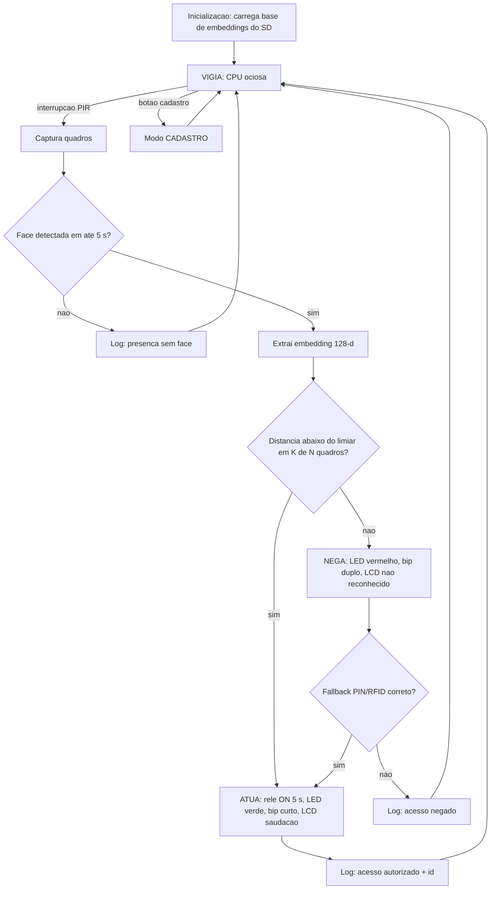
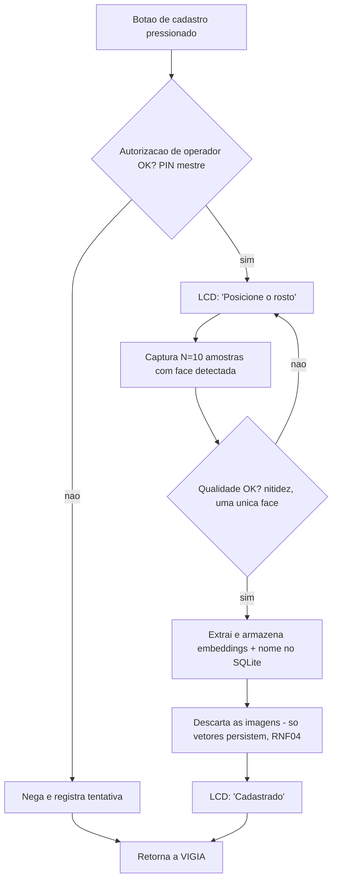
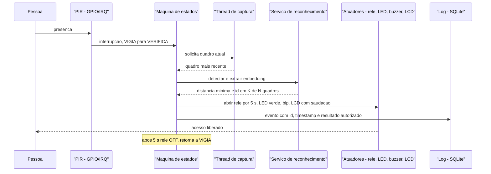
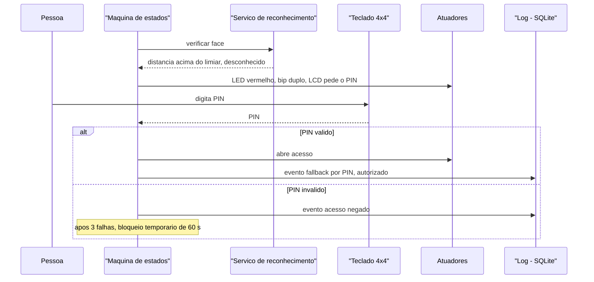

# Arquitetura da Solução — Controle de Acesso Físico por Reconhecimento Facial

**Plataforma:** Raspberry Pi 3 Model B+ | **Kit de referência:** Freenove (Ultimate/Complete Starter Kit for Raspberry Pi)
**Disciplina:** PCS3732 – Laboratório de Processadores | **Grupo:** _[preencher]_

---

## 1. Objetivo e escopo

Sistema embarcado que captura a imagem de uma pessoa diante de um ponto de acesso, verifica sua identidade contra uma base local de usuários cadastrados e, em caso de correspondência, aciona a abertura do acesso físico (fechadura). Todo o processamento é local (*edge computing*): o sistema opera sem dependência de nuvem ou de conectividade, registrando os eventos para auditoria.

## 2. Requisitos

Derivados dos objetivos levantados na etapa anterior (metrônomo: PWM, temporização, interrupções e tolerância a falhas no RPi 3), estendidos ao novo domínio:

| ID | Requisito | Critério de aceite |
|----|-----------|--------------------|
| RF01 | Detectar a presença de uma pessoa no ponto de acesso | Detecção de presença dispara a captura em < 500 ms |
| RF02 | Capturar imagem e detectar face no quadro | Face frontal detectada a 0,5–1,5 m da câmera |
| RF03 | Reconhecer a face contra a base de cadastrados | Decisão (autorizado/negado) em ≤ 3 s do enquadramento |
| RF04 | Abrir o acesso em caso de correspondência | Fechadura acionada por 5 s; feedback visual (LED verde) e sonoro |
| RF05 | Negar e sinalizar em caso de não correspondência | LED vermelho + bip distinto; acesso permanece travado |
| RF06 | Cadastro local de usuários (enrolamento) | Modo de cadastro por botão físico + captura de N amostras |
| RF07 | Registrar eventos (acesso, negação, cadastro) com data/hora | Log persistente consultável após reinício |
| RNF01 | Taxa de falsa aceitação (FAR) minimizada | Limiar de decisão calibrado; FAR < FRR nos testes do grupo |
| RNF02 | Operação 100% offline | Nenhuma função depende de Internet |
| RNF03 | Tolerância a falha de energia | Estado (base de faces, logs) persistido; fechadura *fail-secure* |
| RNF04 | Privacidade (LGPD) | Dados biométricos armazenados apenas localmente, como vetores de características (não imagens), com consentimento no cadastro |

## 3. Seleção de componentes

O kit Freenove não inclui câmera nem fechadura — esses dois itens são as únicas adições externas. Todo o restante sai do kit:

| Função | Componente (kit Freenove) | Papel na arquitetura | Alternativas |
|--------|---------------------------|----------------------|--------------|
| Sensoriamento de presença | Sensor PIR HC-SR501 | Gatilho de captura (RF01); evita processamento contínuo | Sensor ultrassônico HC-SR04 (também no kit); detecção de movimento por software na própria câmera |
| Captura de imagem | **(externo)** Raspberry Pi Camera Module v2 (CSI) | Fonte de vídeo (RF02) | Webcam USB UVC; Freenove Camera Module (compatível CSI) |
| Atuação do acesso | Módulo relé do kit + **(externo)** fechadura solenoide 12 V | Abertura física (RF04) | Servo SG90 do kit acionando uma tranca simples (protótipo de bancada, sem fechadura real) |
| Feedback visual | LEDs verde/vermelho + resistores 330 Ω | Autorizado/negado (RF04/RF05) | LED RGB do kit |
| Feedback sonoro | Buzzer ativo | Bips de confirmação/negação | Buzzer passivo (tons distintos via PWM) |
| Interface de operação | Botão táctil (modo cadastro) + LCD1602 I2C | RF06; mensagens de estado ("Aproxime-se", "Bem-vindo, X") | Teclado matricial 4×4 do kit (PIN de fallback) |
| Autenticação de reserva | Teclado matricial 4×4 ou leitor RFID MFRC522 (kits Complete/Ultra) | Fator alternativo quando o reconhecimento falha (FRR) | — |
| Processamento | Raspberry Pi 3 Model B+ (BCM2837B0, 4× Cortex-A53 1,4 GHz, 1 GB RAM) | Todo o pipeline de visão e controle | RPi 4/5 (maior desempenho); acelerador USB Google Coral para inferência |

Justificativa das duas escolhas externas: a câmera CSI é preferível à USB porque o barramento dedicado com ISP em hardware descarrega a CPU — crítico num SoC de 1 GB de RAM que também executará a inferência (RASPBERRY PI FOUNDATION, 2024). A fechadura solenoide via relé (e não via servo) separa galvanicamente o circuito de potência 12 V do GPIO de 3,3 V; o servo do kit permanece como alternativa didática de bancada.

## 4. Arquitetura física (diagrama de blocos)

```
                              +------------------------------------------+
     [PIR HC-SR501]--GPIO17-->|                                          |
     [Botao cadastro]-GPIO27->|         Raspberry Pi 3 Model B+          |--GPIO22--[LED verde]
     [Teclado 4x4]--GPIO(8x)->|   BCM2837B0 - 4x Cortex-A53 @ 1,4 GHz    |--GPIO23--[LED vermelho]
                              |                                          |--GPIO24--[Buzzer ativo]
     [Camera v2]====CSI======>|  +------------+  +--------------------+  |
                              |  | ISP/GPU    |  | CPU: pipeline de   |  |--GPIO25--[Rele]--(12V)--[Fechadura
     [LCD1602]=====I2C=======>|  | (captura)  |  | visao + controle   |  |                          solenoide]
                              |  +------------+  +--------------------+  |
                              |        [SD card: base de faces + logs]   |
                              +------------------------------------------+
```

Decisões físicas relevantes: PIR e botão em GPIOs com interrupção (borda); relé em GPIO dedicado com o sistema garantindo nível baixo na inicialização (fechadura travada por padrão); alimentação da fechadura por fonte 12 V independente — o Pi 3B+ não fornece essa potência e transientes da solenoide poderiam reiniciá-lo.

## 5. Arquitetura de software

Organização em **camadas**, com o pipeline de visão isolado do controle de atuadores:

```
+---------------------------------------------------------------+
| Aplicacao: maquina de estados (VIGIA -> VERIFICA -> ATUA)     |
|            modo cadastro | politica de decisao (limiar)       |
+---------------------------------------------------------------+
| Servicos: reconhecimento (embeddings + distancia)             |
|           deteccao de face | base de usuarios | log/auditoria |
+---------------------------------------------------------------+
| Infraestrutura: captura (Picamera2) | GPIO (gpiozero/lgpio)   |
|                 persistencia (SQLite) | LCD (I2C)             |
+---------------------------------------------------------------+
| SO: Raspberry Pi OS (Linux) - drivers CSI, I2C, gpiochip      |
+---------------------------------------------------------------+
```

**Processos/threads** (paralelismo sobre os 4 núcleos, lição da etapa do metrônomo):

- **Thread de captura** — mantém o buffer da câmera atualizado (sempre o quadro mais recente, descartando antigos, para a decisão não operar sobre imagem defasada).
- **Thread principal (máquina de estados)** — VIGIA (aguarda PIR) → VERIFICA (detecta + reconhece, com timeout) → ATUA (abre/nega) → volta a VIGIA.
- **Callbacks de GPIO** — PIR e botão de cadastro por interrupção (borda de subida/descida com debounce), nunca por *polling*.
- **Escrita de log** — fila + thread própria, para o I/O no SD não bloquear a decisão.

**Pipeline de reconhecimento** (decisão central da arquitetura — ver justificativas na seção 8):

1. *Gating* por PIR: a CPU fica ociosa até haver presença (economia térmica/energética; o Pi 3B+ sofre *throttling* térmico sob carga contínua).
2. Detecção de face por HOG (dlib) em quadro reduzido (ex.: 320×240).
3. Extração do vetor de características de 128 dimensões (*embedding*) da face detectada com a rede ResNet do dlib (KING, 2009), via biblioteca `face_recognition` (GEITGEY, 2018).
4. Comparação por distância euclidiana contra os embeddings cadastrados; correspondência se distância < limiar (padrão 0,6, a calibrar nos testes — RNF01).
5. Política de decisão: exigir K correspondências em N quadros consecutivos (ex.: 2 de 3) antes de atuar, reduzindo falsas aceitações por quadro isolado.

## 6. Fluxogramas

### 6.1 Laço principal (máquina de estados)



### 6.2 Cadastro (enrolamento)



## 7. Diagramas de sequência

### 7.1 Acesso autorizado



### 7.2 Acesso negado com fallback



## 8. Rastreabilidade: requisito → elemento arquitetural

| Requisito | Elemento da arquitetura que o suporta |
|-----------|----------------------------------------|
| RF01 (presença) | PIR em GPIO com interrupção; estado VIGIA de baixo consumo |
| RF02 (captura/detecção) | Câmera CSI + thread de captura; detector HOG em quadro reduzido |
| RF03 (reconhecimento ≤ 3 s) | Embeddings 128-d pré-computados na base; comparação O(n) por distância; *gating* por PIR liberando a CPU para o pico de inferência |
| RF04/RF05 (atuar/negar) | Estado ATUA da máquina de estados; relé + LEDs + buzzer + LCD; política K-de-N |
| RF06 (cadastro) | Modo CADASTRO por botão + PIN mestre; fluxo de enrolamento com validação de qualidade |
| RF07 (auditoria) | Thread de log com fila; SQLite no SD; timestamps |
| RNF01 (FAR) | Limiar calibrável + decisão K-de-N + fallback PIN (compensa FRR sem relaxar o limiar) |
| RNF02 (offline) | Todo o pipeline local; nenhuma chamada de rede no caminho crítico |
| RNF03 (energia) | Fechadura *fail-secure* (sem energia = travada); base e logs em SQLite (transacional); relé inicializado em nível baixo |
| RNF04 (LGPD) | Armazenam-se apenas vetores de características, não imagens; base local cifrável; consentimento no fluxo de cadastro |

## 9. Justificativa das decisões arquiteturais

**D1 — Processamento local (edge), não em nuvem.** Elimina a dependência de Internet no caminho crítico (RNF02), reduz a latência a um fator local e mantém os dados biométricos sob custódia do controlador (RNF04). Dados biométricos são classificados como **dados pessoais sensíveis** pela LGPD (BRASIL, 2018, art. 5º, II), o que torna a minimização de tráfego e armazenamento uma decisão de projeto, não apenas de desempenho.

**D2 — Embeddings (dlib/`face_recognition`) em vez de LBPH ou CNN pesada.** Três opções foram consideradas: (i) LBPH (AHONEN; HADID; PIETIKÄINEN, 2006) é leve e roda folgado no Pi 3B+, mas degrada com variação de iluminação e pose; (ii) redes profundas modernas (ex.: FaceNet — SCHROFF; KALENICHENKO; PHILBIN, 2015) têm a melhor acurácia, mas são inviáveis em 1 GB de RAM sem acelerador; (iii) o extrator ResNet do dlib (KING, 2009) produz embeddings de 128 dimensões com acurácia de 99,38% no benchmark LFW segundo a documentação da biblioteca `face_recognition` (GEITGEY, 2018), com inferência da ordem de 1–2 s por face no Pi 3 — dentro do RF03 graças ao *gating* por PIR e à detecção em quadro reduzido. É o melhor compromisso acurácia×recursos; a migração para um acelerador Coral fica registrada como evolução, não como necessidade.

**D3 — Detecção por HOG, não Haar nem CNN.** O detector Haar (VIOLA; JONES, 2001) é o mais rápido, porém com mais falsos positivos; o detector CNN do dlib é preciso demais em custo para o 3B+. HOG é o meio-termo adotado — e a detecção é o filtro barato que evita rodar o extrator (caro) em quadros sem face.

**D4 — *Gating* por PIR em vez de análise contínua de vídeo.** Rodar detecção continuamente manteria os 4 núcleos carregados, com *throttling* térmico e desperdício energético. O PIR custa um GPIO e uma interrupção, e casa com o modelo de interrupções estudado na etapa anterior (portas de E/S e eventos — PEREIRA, 2007). Trade-off assumido: latência adicional de ~centenas de ms na primeira captura (dentro do RF01).

**D5 — Máquina de estados explícita + threads.** A separação captura/decisão/atuação/log em threads distintas repete a lição do metrônomo: o caminho crítico (decisão) nunca bloqueia em I/O (SD, LCD). O BCM2837B0 é quad-core (UPTON; HALFACREE, 2017), e as threads do pipeline são majoritariamente I/O-bound, então o GIL do CPython não é gargalo; a inferência (CPU-bound) roda em bibliotecas nativas que liberam o GIL.

**D6 — Fechadura *fail-secure* via relé.** Sem energia, a solenoide permanece travada: falha de energia não abre o acesso (RNF03). O relé isola o circuito 12 V do GPIO 3,3 V. Nota de projeto: em portas de rota de fuga, normas de segurança contra incêndio podem exigir *fail-safe* — a decisão deve ser revista conforme o local de instalação.

**D7 — Fallback por PIN/RFID.** Reconhecimento facial tem FRR não nulo (usuário legítimo negado por iluminação, óculos, ângulo). O teclado matricial do kit fornece um segundo fator de recuperação sem relaxar o limiar do facial — tratar o erro do sensor no nível do sistema, e não forçando o algoritmo além do seu ponto ótimo.

**D8 — SQLite para base e logs.** Transacional (atomicidade protege contra corrupção em queda de energia — RNF03), sem servidor, arquivo único fácil de versionar/backupear, e suficiente para dezenas de usuários e milhares de eventos.

## 10. Versão resumida da arquitetura

> **Sistema:** controle de acesso por reconhecimento facial, 100% local, sobre Raspberry Pi 3B+.
>
> **Hardware:** PIR (gatilho, IRQ) → Câmera CSI v2 (captura) → Pi 3B+ (pipeline de visão) → relé + fechadura solenoide 12 V (atuação *fail-secure*), com LEDs/buzzer/LCD1602 para feedback, botão de cadastro e teclado 4×4 como fallback de PIN. Tudo, exceto câmera e fechadura, sai do kit Freenove.
>
> **Software:** máquina de estados VIGIA → VERIFICA → ATUA em Python; detecção HOG em quadro reduzido; reconhecimento por embeddings de 128-d (dlib/`face_recognition`) comparados por distância euclidiana com limiar calibrado e decisão K-de-N; threads separadas para captura, decisão e log (SQLite); GPIO por interrupção.
>
> **Decisões-chave:** processamento na borda (privacidade/LGPD + operação offline); PIR como *gating* para poupar CPU; embeddings como compromisso acurácia×recursos do 3B+; fechadura *fail-secure* e logs transacionais para tolerância a falhas; fallback por PIN para compensar FRR.
>
> **Limites conhecidos:** ~1–2 s de inferência por face no 3B+ (atende RF03 com margem estreita); sem anti-spoofing robusto (foto impressa pode enganar — mitigável com desafio de movimento ou câmera IR em versão futura); evolução natural: acelerador Coral USB ou RPi 5.

## Referências (ABNT NBR 6023)

> AHONEN, T.; HADID, A.; PIETIKÄINEN, M. Face description with local binary patterns: application to face recognition. **IEEE Transactions on Pattern Analysis and Machine Intelligence**, v. 28, n. 12, p. 2037–2041, 2006.

> BRASIL. **Lei nº 13.709, de 14 de agosto de 2018** (Lei Geral de Proteção de Dados Pessoais – LGPD). Diário Oficial da União: Brasília, DF, 15 ago. 2018.

> FREENOVE. **Freenove Ultimate Starter Kit for Raspberry Pi — Tutorial**. Shenzhen: Freenove Technology, 2023. Disponível em: https://github.com/Freenove/Freenove_Ultimate_Starter_Kit_for_Raspberry_Pi. Acesso em: 14 jul. 2026.

> GEITGEY, A. **face_recognition: the world's simplest facial recognition API for Python**. 2018. Disponível em: https://github.com/ageitgey/face_recognition. Acesso em: 14 jul. 2026.

> KING, D. E. Dlib-ml: a machine learning toolkit. **Journal of Machine Learning Research**, v. 10, p. 1755–1758, 2009.

> PEREIRA, F. **Tecnologia ARM: microcontroladores de 32 bits**. São Paulo: Érica, 2007.

> RASPBERRY PI FOUNDATION. **Raspberry Pi Camera Module documentation**. 2024. Disponível em: https://www.raspberrypi.com/documentation/accessories/camera.html. Acesso em: 14 jul. 2026.

> SCHROFF, F.; KALENICHENKO, D.; PHILBIN, J. FaceNet: a unified embedding for face recognition and clustering. In: **IEEE Conference on Computer Vision and Pattern Recognition (CVPR)**, 2015, Boston. Proceedings [...]. p. 815–823.

> UPTON, E.; HALFACREE, G. **Raspberry Pi: manual do usuário**. São Paulo: Novatec, 2017.

> VIOLA, P.; JONES, M. Rapid object detection using a boosted cascade of simple features. In: **IEEE Conference on Computer Vision and Pattern Recognition (CVPR)**, 2001, Kauai. Proceedings [...]. p. 511–518.

_Conferir datas de acesso e complementar cidade/editora conforme o padrão exigido pela disciplina antes da entrega._
