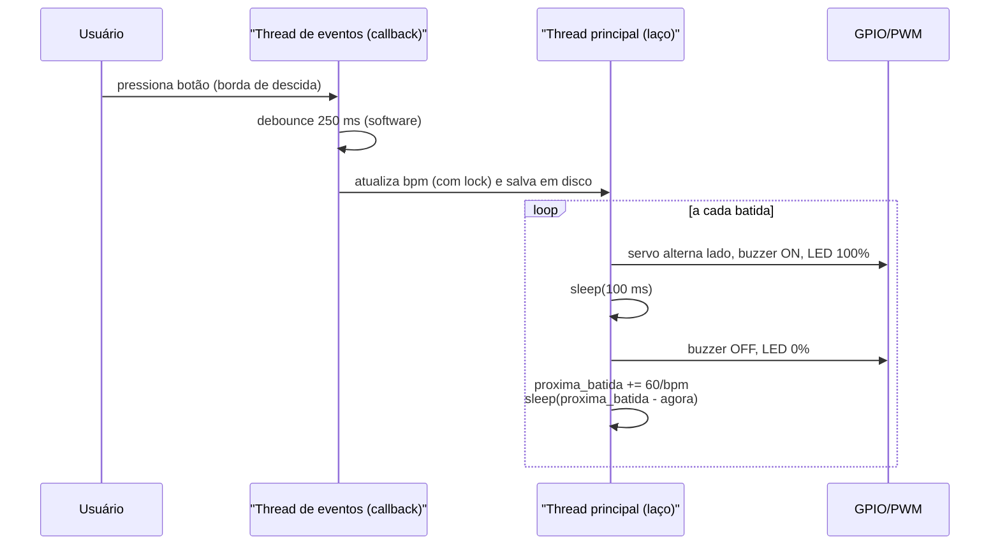

# Projeto Metrônomo: Temporização e PWM no Raspberry Pi 3

**Disciplina:** PCS3732 – Laboratório de Processadores

---

## 1. Leitura pré-aula

A leitura de Pereira (2007, seções 5.2 e 5.5) fundamenta os dois pilares do projeto:

- **Portas de E/S (5.2):** em microcontroladores ARM, cada pino de E/S é controlado por registradores de direção, de dado e de função alternada. No Raspberry Pi 3 o conceito se materializa nos registradores `GPFSEL` (seleção de função), `GPSET`/`GPCLR` (escrita) e `GPLEV` (leitura) do SoC BCM2837: um mesmo pino físico pode operar como GPIO genérico ou ser roteado para um periférico interno (por exemplo, o bloco PWM), exatamente o mecanismo de "função alternada" descrito no texto. Os resistores de pull-up/pull-down internos, usados nos botões deste projeto, também são configuráveis por registrador.
- **Timers (5.5):** o texto apresenta timers/contadores como periféricos que contam pulsos de um clock prescalado e disparam eventos por comparação (match), base tanto da geração de PWM por hardware (comparadores definem o duty cycle sem intervenção da CPU) quanto da temporização periódica por interrupção. Essa distinção — temporização por hardware (determinística) versus por software (sujeita ao escalonador) — orientou as decisões de projeto discutidas na seção 5.

A exploração do simulador **CPUlator (ARM v7)** permitiu exercitar, antes do laboratório, o acesso a registradores de E/S mapeados em memória e laços de temporização por contagem de instruções, evidenciando por que laços de espera ocupada são imprecisos quando há um sistema operacional entre o programa e o hardware.

_[Registrar aqui prints/observações do CPUlator feitos pelo grupo.]_

## 2. Especificação de requisitos e testes

| ID | Requisito | Método de teste | Resultado esperado |
|----|-----------|-----------------|--------------------|
| RF01 | Temporização: servo + buzzer acionados a cada 1 s (60 BPM) | Registro de timestamps (`time.monotonic()`) de 60 batidas consecutivas; opcionalmente analisador lógico no GPIO | Período médio de 1000 ms; jitter < 5 ms; **sem drift acumulado** ao longo de 60 s |
| RF02 | Ajuste de BPM por botões físicos (30–240, passo 5) | Pressões simples, rápidas e simultâneas nos dois botões | Incremento/decremento correto sem interromper o laço da batida |
| RF03 | Modulação PWM: LED com brilho gradual; servo com posicionamento angular 0°–180° | Varredura de duty cycle (LED) e de largura de pulso 1,0–2,0 ms (servo) | LED sem cintilação visível a 1 kHz; servo atinge as posições comandadas |
| RF04 | Sinal sonoro a cada ciclo, com duração de 100 ms | Teste isolado do buzzer (ativo/passivo) e no sistema integrado | Bip audível e curto, síncrono com o movimento do servo |
| RNF01 | Rejeição de bouncing mecânico dos botões | 5 cliques rápidos dentro de ~100 ms | Registro de apenas 1 evento válido |
| RNF02 | Tolerância a falha de energia: BPM restaurado após religar | Ajustar BPM, remover alimentação, religar | Metrônomo retoma no último BPM salvo |

### Resultados intermediários registrados

_[Preencher no laboratório — a atividade pede o registro de todos os resultados intermediários:]_

- Atividade 1 (LED, `teste_led.py`): frequência a partir da qual não se percebe cintilação: ___ Hz; comportamento do brilho na varredura de duty: ___
- Atividade 2 (servo, `teste_servo.py`): ângulos reais medidos para 1,0/1,5/2,0 ms: ___; jitter observado com PWM por software: ___
- Atividade 3 (buzzer, `teste_buzzer.py`): tipo do buzzer do kit (ativo/passivo): ___; frequência mais audível: ___
- Atividade 4 (integração): período médio e jitter medidos: ___

## 3. Arquitetura do sistema

### 3.1 Arquitetura física

```
                       +--------------------------+
  [Botão INC]--GPIO16->|                          |--GPIO18--[330Ω]--[LED]--GND
  [Botão DEC]--GPIO20->|  Raspberry Pi 3 (BCM2837 |
   (pull-up interno,   |  ARM Cortex-A53, 4 cores)|--GPIO12--[Servo SG90 (sinal)]
    acionam para GND)  |                          |           +5V / GND dedicados
                       |                          |--GPIO23--[Buzzer]--GND
                       +--------------------------+
```

Observação de projeto: GPIO12 e GPIO18 correspondem, por função alternada, ao mesmo canal de PWM de hardware (PWM0); GPIO13/GPIO19 correspondem ao PWM1. Com a biblioteca `RPi.GPIO` isso é irrelevante (o PWM é por software), mas numa migração para PWM de hardware (`pigpio`) o servo e o LED precisariam ficar em canais distintos (ex.: servo em GPIO18/PWM0 e LED em GPIO13/PWM1).

### 3.2 Arquitetura de software

Três fluxos de execução concorrentes:

1. **Thread principal** — laço do metrônomo: dispara a batida (servo alterna 45°/135°, buzzer e LED pulsam 100 ms) e dorme até o próximo instante **agendado em tempo absoluto** (`proxima_batida += periodo`), eliminando acúmulo de drift.
2. **Thread de eventos da RPi.GPIO** — criada por `add_event_detect`; executa os callbacks dos botões (borda de descida, debounce de 250 ms em software) que atualizam a variável compartilhada `bpm` sob `threading.Lock` e persistem o valor em disco.
3. **Threads de PWM da RPi.GPIO** — a biblioteca gera cada PWM em software, comutando o pino em uma thread própria (daí o jitter observado no servo).



## 4. Método experimental

### 4.1 Sequência de experimentos (isolados → integrado)

1. `teste_led.py` — PWM no LED em 1 a 1000 Hz com duty fixo (percepção de cintilação) e varredura de duty a 1 kHz (dimmer).
2. `teste_servo.py` — posições discretas, varredura contínua e comportamento com duty 0 (servo relaxado, sem jitter).
3. `teste_buzzer.py` — identificação do tipo de buzzer; tons via PWM (passivo) ou níveis lógicos (ativo).
4. `metronomo.py` — sistema integrado com botões e persistência.

### 4.2 Plano de integração

Integração **incremental, um atuador por vez**, validando a temporização a cada passo antes de acrescentar o próximo componente:

| Passo | Componentes | Critério de aceite antes de avançar |
|-------|-------------|--------------------------------------|
| I1 | Laço de temporização + LED | 60 flashes em 60,00 s ± 0,05 s (log de timestamps) |
| I2 | I1 + buzzer | Bip síncrono com o flash; sem alteração do período |
| I3 | I2 + servo | Movimento completa o curso dentro do período; período mantido |
| I4 | I3 + botões | BPM muda sem travar o laço; sem eventos duplicados |
| I5 | I4 + persistência | BPM restaurado após reinício |

Justificativa: cada passo acrescenta exatamente uma fonte de erro possível; se o período degradar do passo In para In+1, a causa está no componente recém-adicionado.

### 4.3 Plano de depuração

- **Instrumentação por log:** imprimir `time.monotonic()` a cada batida e calcular período e jitter em pós-processamento (planilha/script). É o método primário, por não exigir instrumento externo.
- **Medição externa:** quando disponível, analisador lógico ou osciloscópio no GPIO do buzzer/LED para medir o período sem interferência do próprio software.
- **Isolamento de falhas:** se o sintoma é de temporização → revisar laço/agendamento; se é de atuador → voltar ao script de teste isolado correspondente; se é de botão → observar prints do callback.
- **Casos de estresse:** BPM máximo (240 → período de 250 ms, próximo da duração do pulso de 100 ms); mudança de BPM durante a batida; carga artificial de CPU (`stress`) para observar degradação do jitter.

### 4.4 O que deu certo e o que deu errado

_[Preencher com os resultados reais do laboratório. Registro do desenvolvimento prévio:]_

- **Errado (versão inicial):** o pêndulo comandava 0° → 180° com apenas 100 ms entre os comandos — fisicamente impossível para o SG90 (~0,3 s para 180° sem carga). O servo oscilava de forma parcial e irregular. **Refinamento:** alternar o lado a cada batida (45°/135°), dando o período inteiro para o deslocamento.
- **Errado (versão inicial):** compensação de drift que media apenas o tempo de execução do bloco de acionamento; o overshoot do `time.sleep()` (o Linux nunca acorda o processo antes, e frequentemente acorda alguns ms depois) acumulava-se a cada ciclo. **Refinamento:** agendamento por tempo absoluto ancorado em `time.monotonic()`.
- **Errado (documentação):** descrever o `bouncetime` como "flag de hardware do controlador ARM". O debounce do `RPi.GPIO` é feito em software pela biblioteca. **Refinamento:** corrigida a documentação; alternativa de hardware (filtro RC) registrada como opção.
- **Certo:** separação em threads (laço × callbacks) manteve o laço de batida livre de bloqueio durante o ajuste de BPM; a matriz de requisitos definida no planejamento guiou diretamente os testes.

## 5. Questões (respostas fundamentadas)

### 5.1 Como o PWM é implementado no Raspberry Pi 3?

Há duas vias, com propriedades muito diferentes:

- **PWM por hardware:** o SoC BCM2837 possui um periférico PWM com **dois canais** (PWM0 e PWM1), roteáveis por função alternada para pinos específicos (PWM0: GPIO12/GPIO18; PWM1: GPIO13/GPIO19). O periférico recebe um clock derivado do gerenciador de clocks (com divisor programável) e gera a forma de onda por comparação entre um contador e os registradores de faixa (range) e de dado (duty), sem participação da CPU — o mesmo princípio de timer com comparador descrito por Pereira (2007, seção 5.5). O resultado é imune à carga do sistema operacional (BROADCOM, 2012).
- **PWM por software:** a biblioteca `RPi.GPIO`, usada neste projeto, gera o PWM comutando o pino em uma thread de usuário temporizada por `sleep`. Como essa thread disputa a CPU com os demais processos sob o escalonador do Linux, a forma de onda apresenta *jitter* — perceptível como tremor no servo. A biblioteca `pigpio` oferece um meio-termo: usa DMA sincronizado aos periféricos de hardware para gerar pulsos precisos (~1 µs) em **qualquer** GPIO (PIGPIO, 2023).

Para o metrônomo, o PWM por software foi suficiente (o servo tolera erro de largura de pulso da ordem de dezenas de µs, e o LED/buzzer são ainda menos sensíveis), mas a migração para `pigpio`/PWM de hardware é o refinamento natural se o requisito de suavidade do servo for endurecido.

### 5.2 Como podemos implementar a temporização no Raspberry Pi 3?

Camadas disponíveis, da mais baixa à mais alta:

1. **System Timer do SoC:** contador livre de 64 bits a 1 MHz com canais de comparação — a base de tempo de hardware usada pelo kernel (BROADCOM, 2012).
2. **Chamadas de sistema no Linux:** `clock_nanosleep`, `timerfd` e, em Python, `time.sleep()` sobre o relógio do sistema. A resolução nominal é alta, mas o instante de despertar depende do escalonador: o processo nunca acorda antes do prazo, e pode acordar milissegundos depois.
3. **Estratégia de aplicação (adotada):** agendamento por **tempo absoluto** — manter `proxima_batida += periodo` ancorado em `time.monotonic()` e dormir a diferença até esse instante. Assim o erro de cada `sleep` não se propaga: um atraso em uma batida é automaticamente descontado do intervalo seguinte, e o erro **médio** de longo prazo tende a zero, ainda que o jitter individual persista. A alternativa ingênua (`sleep(periodo)` ou desconto apenas do tempo de execução) acumula o overshoot de cada ciclo — drift crescente e ilimitado.

Recomenda-se `time.monotonic()` em vez de `time.time()`: o relógio de parede pode saltar (ajuste NTP), corrompendo intervalos medidos.

### 5.3 É possível suportar um requisito de tempo real?

**Estrito (hard real-time), não, na configuração padrão.** O Raspberry Pi OS usa um kernel Linux preemptivo de propósito geral: não há garantia de latência máxima, apenas comportamento estatisticamente bom (jitter típico de centenas de µs a alguns ms, degradando sob carga). Para requisitos de tempo real:

- **Soft real-time:** kernel com `PREEMPT_RT`, prioridade `SCHED_FIFO` para a thread crítica e isolamento de núcleo (`isolcpus`) reduzem a latência de pior caso a dezenas de µs — suficiente para muitas aplicações de controle.
- **Delegação a hardware:** mover a geração do sinal crítico para periféricos autônomos (PWM de hardware, DMA), de modo que a CPU só ajuste parâmetros — foi o critério usado na análise do item 5.1.
- **Hard real-time verdadeiro:** exige bare-metal no próprio SoC ou um microcontrolador dedicado (ex.: RP2040/Arduino) como coprocessador de tempo real, com o Pi no papel de supervisor.

Para o metrônomo (tolerância de ~5 ms, perceptível apenas por músicos treinados acima disso), o Linux padrão com agendamento absoluto atendeu — trata-se de um requisito *soft*.

### 5.4 E quanto ao suporte a processamento paralelo?

O BCM2837 tem **4 núcleos ARM Cortex-A53** de 64 bits; o Linux escalona threads e processos em SMP sobre eles. Ressalvas para este projeto:

- Em **Python (CPython)**, o *GIL* impede que duas threads executem bytecode simultaneamente; porém as threads deste projeto são *I/O-bound* (dormem a maior parte do tempo), então o paralelismo lógico é plenamente eficaz: os callbacks de botão rodam na thread de eventos da `RPi.GPIO` sem bloquear o laço da batida.
- Para cargas *CPU-bound*, o caminho é `multiprocessing` (processos distintos, um por núcleo).
- A proteção da variável compartilhada `bpm` com `threading.Lock` continua necessária: o GIL não garante atomicidade de sequências leitura-modificação-escrita.

### 5.5 Sincronismo com horário pré-definido

O Pi 3 **não possui RTC** (relógio de tempo real com bateria): ao ligar sem rede, o horário de parede é inválido até a primeira sincronização. Opções de sincronismo:

- **Com Internet:** NTP (serviço `systemd-timesyncd`), que disciplina o relógio com erro típico de poucos ms; agendamento de atuações com `cron` ou *systemd timers*.
- **Sem Internet:** módulo RTC externo (ex.: **DS3231**, via I2C) mantém o horário entre reinicializações; para precisão elevada, receptor GPS com sinal PPS.
- Para eventos **relativos** (como a batida do metrônomo), o relógio de parede é irrelevante — usa-se o relógio monotônico, imune a esses problemas.

### 5.6 Tolerância a falhas de energia e de Internet

**Energia — vulnerável por padrão:** a queda de alimentação causa desligamento imediato; perdem-se o estado em RAM (o BPM ajustado, na versão inicial) e, no pior caso, a integridade do cartão SD (corrupção de escritas pendentes). Mitigações adotadas/recomendadas:

- **Persistência de estado (implementada):** o BPM é gravado em arquivo com escrita atômica (arquivo temporário + `os.replace`) a cada alteração e restaurado na inicialização — requisito RNF02.
- UPS/power bank com desligamento ordenado; sistema de arquivos somente-leitura (overlay) para eliminar o risco de corrupção; watchdog de hardware do SoC (via `systemd`) para reinício automático em travamento, com o serviço do metrônomo configurado com `Restart=always`.

**Internet — impacto limitado:** o metrônomo opera 100% localmente; a perda de rede não afeta a função. O único efeito colateral é a perda da referência NTP — combinada à ausência de RTC, o horário de parede fica incorreto após um reinício offline (relevante apenas se houver atuações agendadas por horário, caso do item 5.5).

## 6. Lições aprendidas

1. **Temporização correta é agendamento absoluto, não desconto de tempo de execução.** O overshoot do `sleep` é inevitável em SO de propósito geral; a diferença entre uma solução que dá certo e uma que deriva é *onde* se ancora o próximo evento.
2. **O atuador tem física própria.** O servo não é instantâneo: comandar 180° de curso em 100 ms é um erro de especificação, não de código. Requisitos devem considerar a dinâmica do hardware (velocidade do SG90 ≈ 0,1 s/60°).
3. **Saber o que é hardware e o que é software.** O PWM da `RPi.GPIO` e o `bouncetime` são software puro; confundi-los com recursos do SoC leva a expectativas erradas de precisão e a documentação incorreta.
4. **Integração incremental com critério de aceite por passo** localiza defeitos por construção: a falha só pode estar no último componente adicionado.
5. **Estado que importa se persiste.** Um requisito de tolerância a falhas simples (salvar o BPM) custa poucas linhas se pensado desde o projeto.

## Referências (ABNT NBR 6023)

> BROADCOM. **BCM2835 ARM Peripherals**. Cambridge: Broadcom Corporation, 2012. Disponível em: https://datasheets.raspberrypi.com/bcm2835/bcm2835-peripherals.pdf. Acesso em: 14 jul. 2026.

> PEREIRA, Fábio. **Tecnologia ARM: microcontroladores de 32 bits**. São Paulo: Érica, 2007.

> PIGPIO. **pigpio library documentation**. 2023. Disponível em: https://abyz.me.uk/rpi/pigpio/. Acesso em: 14 jul. 2026.

> RASPBERRY PI FOUNDATION. **Raspberry Pi hardware documentation**. Disponível em: https://www.raspberrypi.com/documentation/computers/raspberry-pi.html. Acesso em: 14 jul. 2026.

> UPTON, Eben; HALFACREE, Gareth. **Raspberry Pi: manual do usuário**. São Paulo: Novatec, 2017.

_Nota: o datasheet BCM2835 é a referência oficial dos periféricos (GPIO, PWM, System Timer) também para o BCM2837 do Pi 3, que mantém o mesmo conjunto de periféricos. Conferir as datas de acesso antes da entrega._
